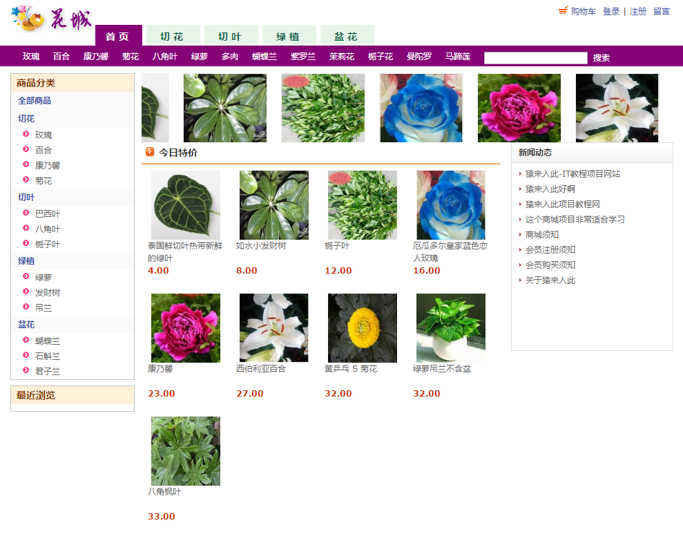
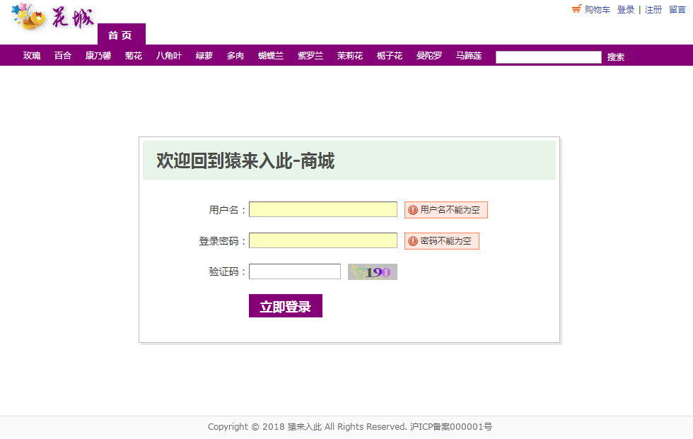
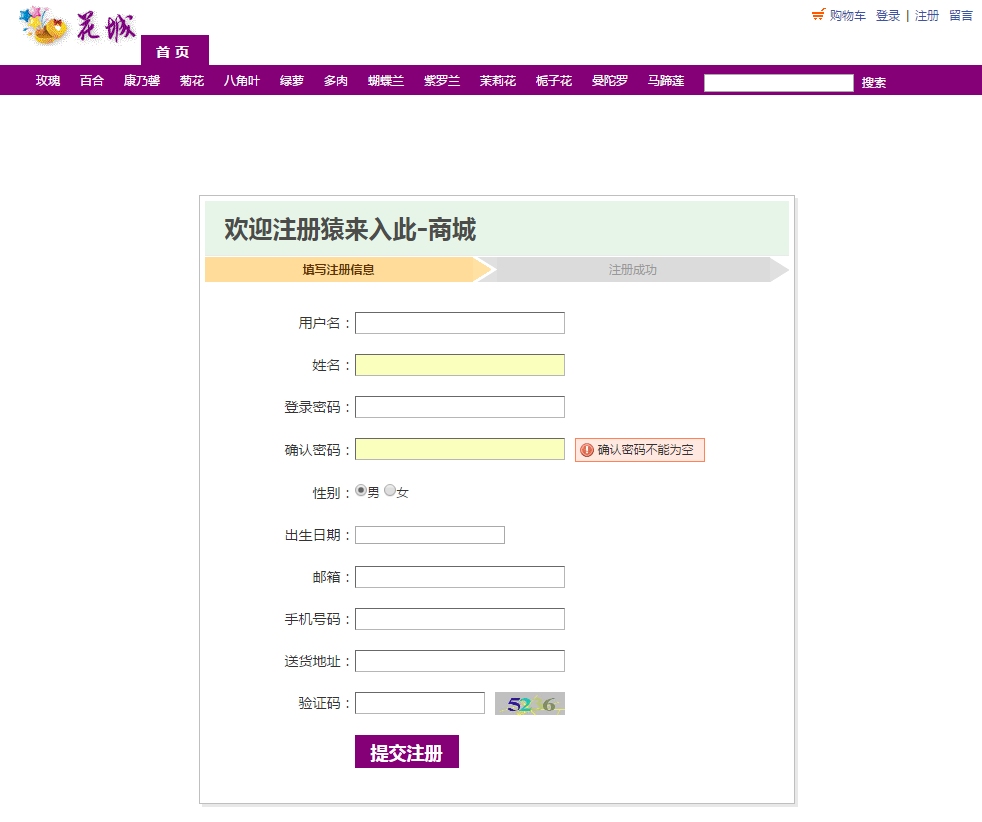
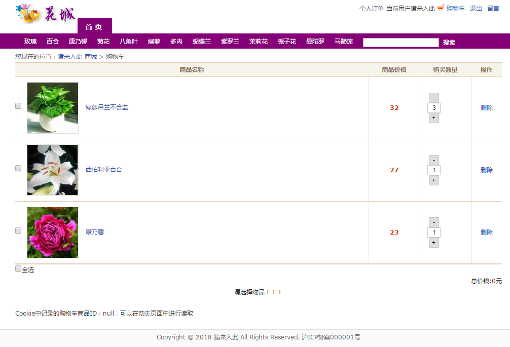
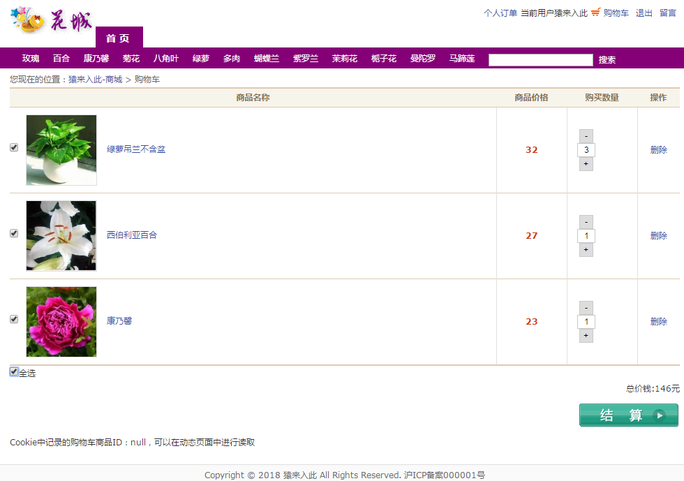
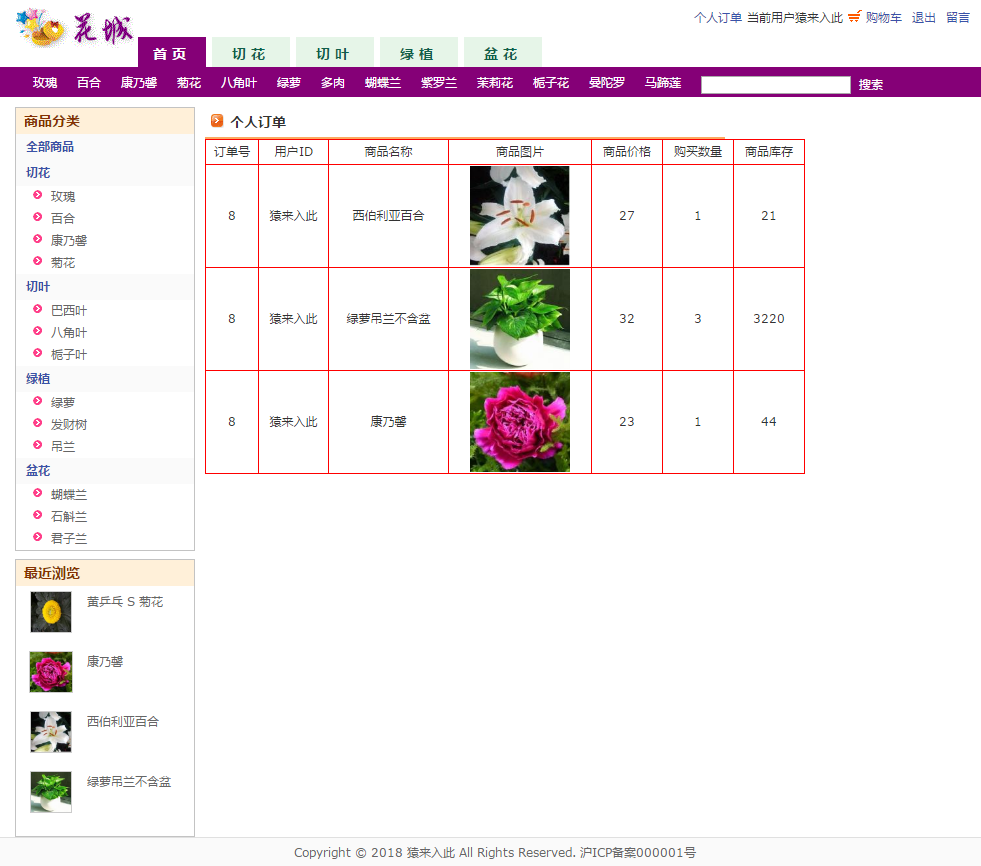
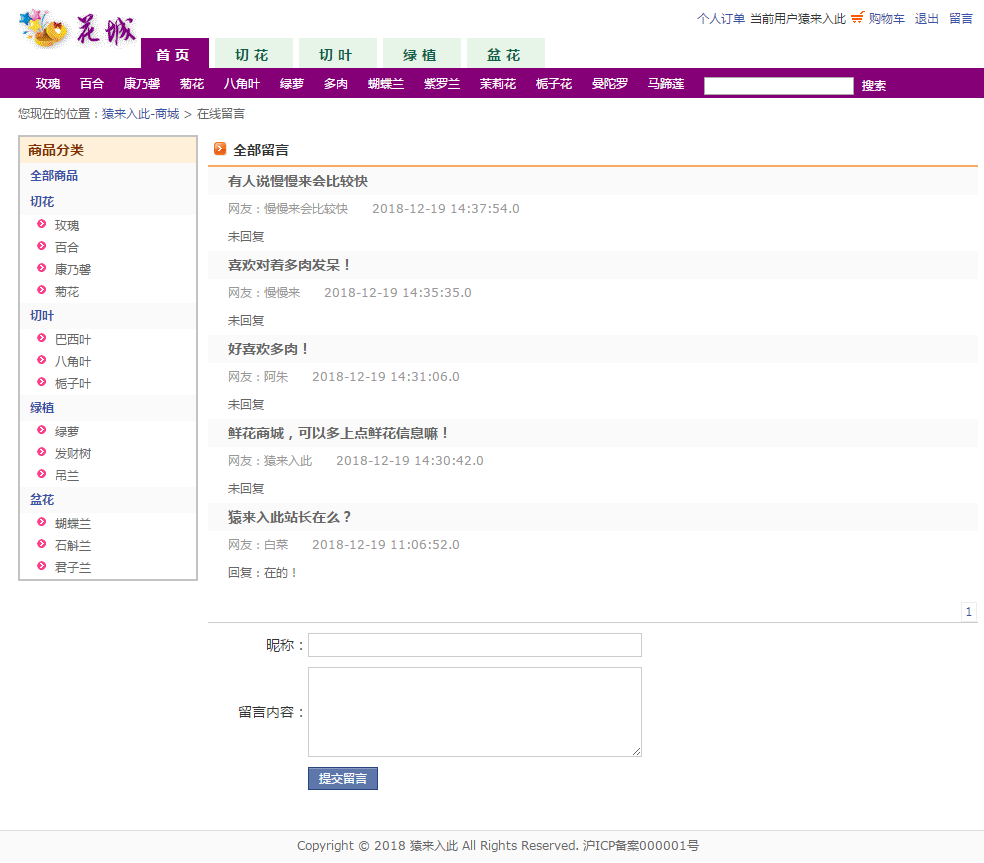
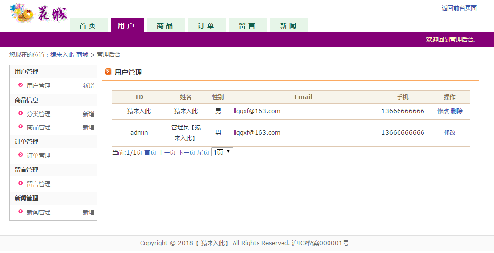
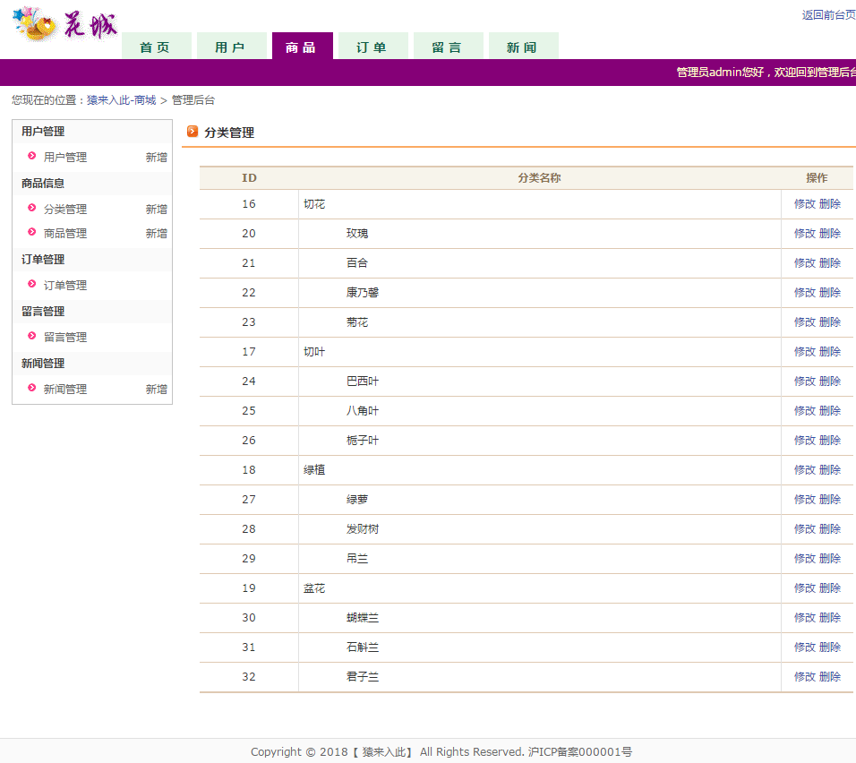

## 基于JSP+Servlet实现的在线鲜花商城系统
###  获取sql数据库文件: 从戎源码网 (https://armycodes.com/) QQ: 386869957 QQ群: 377586148
###  所有系统地址: (https://github.com/YuLin-Coder/AllProjectCatalog) 
###  所有项目以及源代码本人均调试运行无问题 可支持远程安装部署调试、定制修改、代码讲解

## 项目介绍
基于JSP+Servlet实现的在线鲜花商城系统，主要功能如下

【用户】
用户注册和登录、浏览商品、商品搜索和筛选、购物车管理、下单和支付、订单管理、个人信息管理

【管理员】
用户管理：用户管理
商品信息：分类管理，商品管理
订单管理：订单管理
留言管理：留言管理
新闻管理：新闻管理

## 项目技术
- 编程语言：Java
- 数据库：MySQL
- 前端技术：JSP、JavaScript、bootstrap、JQuery
- 后端技术：Servlet、JDBC

## 运行环境
- JDK版本：JDK1.8及以上
- 开发工具：IDEA、Ecplise、Myecplise都可以
- 数据库: MySQL5.7及以上

## 运行截图

